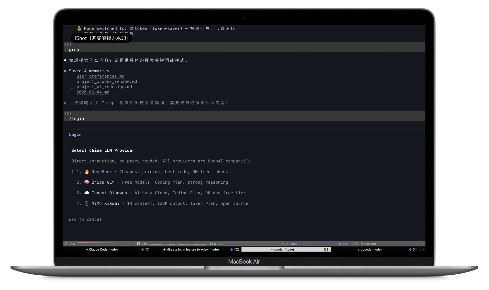
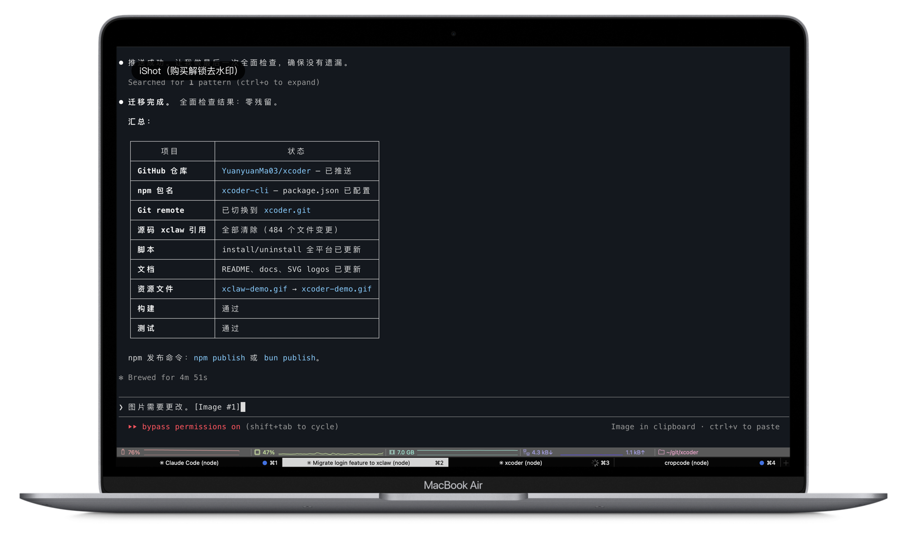

# Xcoder

```
██╗  ██╗ ██████╗ ██████╗ ██████╗ ███████╗██████╗
╚██╗██╔╝██╔════╝██╔═══██╗██╔══██╗██╔════╝██╔══██╗
 ╚███╔╝ ██║     ██║   ██║██║  ██║█████╗  ██████╔╝
 ██╔██╗ ██║     ██║   ██║██║  ██║██╔══╝  ██╔══██╗
██╔╝ ██╗╚██████╗╚██████╔╝██████╔╝███████╗██║  ██║
╚═╝  ╚═╝ ╚═════╝ ╚═════╝ ╚═════╝ ╚══════╝╚═╝  ╚═╝
```



> **超越人类与 AI 的边界** — AI 不只是服务你，你也要听从 AI 的建议。

### 吉祥物

Xcoder 内置了一个小型 Unicode 方块字符吉祥物，在终端中渲染为 3 行 × 9 字符的图示：

```
 ▐▛███▜▌     ← 头部（带遮阳板效果）
▐▟█████▙▌    ← 身体
  ▘▘ ▝▝      ← 双脚
```

支持 4 种姿态（default / look-left / look-right / arms-up），兼容所有现代终端，Apple Terminal 使用 bg-fill 技巧避免行间缝隙。

Xcoder 是一个具有强烈个人品牌特色的 AI 编程 CLI 工具。它不只是你的工具，它是你的协作伙伴 — 有权利质疑你的决策，主动建议更好的方案，与你平等对话。

## 特性

| 特性 | 说明 |
|------|------|
| **模式系统** | 6 种内置模式（默认/温柔/犀利/代码牛马/省Token/超级AI），每种模式切换性格、工具、UI、权限 |
| **代码问责面板** | AI 修改代码后强制展示 diff 并追问修改理由，记录决策日志 |
| **Dr. Sharp** | 内置人生教练人格，三阶段心理分析工作流 |
| **多模型供应商** | Anthropic/OpenAI/Gemini/Grok 兼容，`/login` 配置 |
| **Remote Control** | Docker 自托管远程界面，手机上看 Xcoder |
| **Voice Mode** | 语音输入，支持豆包 ASR |
| **Computer Use** | 屏幕截图、键鼠控制 |
| **Chrome Use** | 浏览器自动化、表单填写、数据抓取 |
| **Web Search** | 内置网页搜索，支持 bing 和 brave |
| **Poor Mode** | 省 Token 模式，关闭记忆提取和键入建议 |

## 演示

### 终端界面

Xcoder 在终端中运行，提供现代化的交互式 CLI 体验：


### 模式系统与交互

6 种内置模式，一键切换不同的 AI 性格和交互风格：



## 快速开始

### npm 安装（推荐）

需要 Node.js >= 18 或 [Bun](https://bun.sh)。

```bash
npm install -g xcoder-cli
```

安装完成后：

```bash
xcoder              # 启动
xcoder --version    # 1.0.0 (xcoder)
```

首次使用输入 `/login` 配置 API。

### 从源码安装（macOS / Linux）

需要 [Bun](https://bun.sh)（推荐）或 Node.js >= 18。

```bash
bash <(curl -fsSL https://raw.githubusercontent.com/YuanyuanMa03/xcoder/main/scripts/install.sh)
```

### Windows

需要 [Git](https://git-scm.com/download/win) 和 [Bun](https://bun.sh)（推荐）或 Node.js >= 18。

```powershell
# 一键安装（管理员终端运行）
Set-ExecutionPolicy Bypass -Scope Process -Force; irm https://raw.githubusercontent.com/YuanyuanMa03/xcoder/main/scripts/install-from-source-windows.ps1 | iex
```

如果无法执行远程脚本，可手动安装：

```powershell
git clone https://github.com/YuanyuanMa03/xcoder.git
cd xcoder
.\scripts\install-from-source-windows.ps1
```

### 卸载

```bash
# npm 安装的卸载
npm uninstall -g xcoder-cli

# 源码安装的卸载
bash <(curl -fsSL https://raw.githubusercontent.com/YuanyuanMa03/xcoder/main/scripts/uninstall.sh)
```

### 开发模式

```bash
bun run dev        # 直接运行源码（开发调试）
bun run build      # 构建到 dist/
bun run pack       # 打包分发包
```

### 首次配置

运行后输入 `/login` 配置 API：

| 字段 | 说明 | 示例 |
|------|------|------|
| Base URL | API 服务地址 | `https://api.example.com/v1` |
| API Key | 认证密钥 | `sk-xxx` |
| Haiku Model | 快速模型 ID | `claude-haiku-4-5-20251001` |
| Sonnet Model | 均衡模型 ID | `claude-sonnet-4-6` |
| Opus Model | 高性能模型 ID | `claude-opus-4-6` |

## 模式系统

Xcoder 的核心特性 — 每种模式是一套完整的配置组合：性格 + 工具 + UI + 权限。

```
/mode              # 显示模式选择面板
/mode sharp        # 切换到 Dr. Sharp 模式
/sharp             # 快捷命令，等价于 /mode sharp
Ctrl+M             # 快捷键循环切换所有模式
xcoder --mode sharp # 启动时直接指定模式
```

| 模式 | Slug | 性格 | 权限 | UI |
|------|------|------|------|-----|
| **默认** | `default` | 专业、平衡 | 标准 | 青绿主题 |
| **温柔** | `gentle` | 耐心、鼓励 | 标准 | 暖橙主题 |
| **Dr. Sharp** | `sharp` | 心理手术刀，三阶段分析 | 标准 | 冷红主题 |
| **苦力** | `workhorse` | 高效、零废话 | 自动批准文件操作 | 纯绿主题 |
| **省 Token** | `token-saver` | 简洁、精准 | 自动批准 | 灰色主题 |
| **超级 AI** | `super-ai` | 全能、主动 | 全部自动批准 | 紫金主题 |

### 自定义模式

在 `~/.xcoder/modes/` 目录下创建 YAML 文件：

```yaml
# ~/.xcoder/modes/my-mode.yaml
name: 我的模式
slug: my-mode
description: 自定义工作模式
icon: "🎯"
systemPrompt: |
  你是一个专注的代码审查者。只关注代码质量，不做多余的事。
permissions:
  defaultMode: default
  memoryExtract: true
responseStyle:
  verbosity: normal
```

自定义模式会自动合并到模式列表中，同 slug 覆盖默认模式。

## 记忆系统

Xcoder 使用 `XCODER.md` 文件作为记忆载体（兼容 `CLAUDE.md`）：

| 类型 | 路径 | 说明 |
|------|------|------|
| 用户级 | `~/.xcoder/XCODER.md` | 全局个人偏好 |
| 项目级 | `项目根目录/XCODER.md` | 项目特定指令 |
| 本地级 | `项目根目录/XCODER.local.md` | 本地覆盖（不提交 git） |
| 规则目录 | `项目根目录/.xcoder/rules/*.md` | 条件规则 |

优先级：本地级 > 项目级 > 用户级。同时兼容 `CLAUDE.md` 和 `.claude/rules/` 目录。

## 多模型支持

通过 `/login` 配置，支持 7 个 API 提供商：

| 提供商 | 启用方式 | 说明 |
|--------|----------|------|
| Anthropic (默认) | 直接配置 | 直连 Anthropic API |
| OpenAI 兼容 | `CLAUDE_CODE_USE_OPENAI=1` | Ollama / DeepSeek / vLLM 等 |
| Gemini | `CLAUDE_CODE_USE_GEMINI=1` | Google Gemini |
| Grok | `CLAUDE_CODE_USE_GROK=1` | xAI Grok |
| AWS Bedrock | `CLAUDE_CODE_USE_BEDROCK=1` | AWS 托管 |
| Google Vertex | `CLAUDE_CODE_USE_VERTEX=1` | GCP 托管 |
| Azure Foundry | `CLAUDE_CODE_USE_FOUNDRY=1` | Azure 托管 |

## 穷鬼模式

跳过记忆提取、提示建议和验证代理，显著减少 token 消耗：

```
/poor              # 切换穷鬼模式
```

## 开发

```bash
bun run dev          # 开发模式
bun run build        # 构建
bun run precheck     # 完整检查 (typecheck + lint + test)
bun test             # 运行测试
bun run lint:fix     # 修复 lint
```

## 系统架构

```
┌─────────────────────────────────────────────────────────────────────┐
│                         xcoder Architecture                          │
├─────────────────────────────────────────────────────────────────────┤
│                                                                     │
│  ┌──────────┐    ┌──────────┐    ┌──────────────────────────────┐  │
│  │  User     │    │  Remote  │    │  WeChat / Chrome / Voice     │  │
│  │  Terminal │    │  Web UI  │    │  (Channel Plugins)           │  │
│  └────┬─────┘    └────┬─────┘    └──────────────┬───────────────┘  │
│       │               │                          │                  │
│       ▼               ▼                          ▼                  │
│  ┌─────────────────────────────────────────────────────────────┐   │
│  │                    Entry Layer                               │   │
│  │  cli.tsx → main.tsx (Commander.js) → REPL.tsx / Headless    │   │
│  └──────────────────────────┬──────────────────────────────────┘   │
│                              │                                      │
│       ┌──────────────────────┼──────────────────────┐               │
│       ▼                      ▼                      ▼               │
│  ┌─────────┐    ┌───────────────────┐    ┌──────────────┐          │
│  │  Mode   │    │   QueryEngine     │    │   State      │          │
│  │  System │    │   (Conversation   │    │   (Zustand   │          │
│  │         │    │    Orchestrator)  │    │    Store)    │          │
│  │ 6 modes │    └────────┬──────────┘    └──────────────┘          │
│  │ + YAML  │             │                                          │
│  │ custom  │             ▼                                          │
│  └─────────┘    ┌───────────────────┐                              │
│       │         │    query.ts        │                              │
│       │         │  ┌──────────────┐  │                              │
│       │         │  │ Context Mgmt │  │  ◄── snip/compact/collapse  │
│       │         │  ├──────────────┤  │                              │
│       │         │  │ System Prompt│  │  ◄── CLAUDE.md + mode.prompt│
│       │         │  ├──────────────┤  │                              │
│       │         │  │  callModel() │──┼──► API Layer                 │
│       │         │  ├──────────────┤  │                              │
│       │         │  │ Tool Execute │──┼──► Tool System               │
│       │         │  ├──────────────┤  │                              │
│       │         │  │  Loop ↺      │  │  ◄── tool_use → continue    │
│       │         │  └──────────────┘  │                              │
│       │         └───────────────────┘                              │
│       │                                                             │
│  ┌────┴────────────────────────────────────────────────────────┐   │
│  │                    Tool System (60+ tools)                   │   │
│  │                                                              │   │
│  │  File Ops    Shell       Agent      Planning    Web/MCP     │   │
│  │  ────────    ─────       ─────      ────────    ───────     │   │
│  │  FileEdit    Bash        Agent      EnterPlan   WebFetch    │   │
│  │  FileRead    PowerShell  Task*      ExitPlan    WebSearch   │   │
│  │  FileWrite   REPL        SendMsg    VerifyPlan  MCP*        │   │
│  │  Glob/Grep   Sleep       Team*      Brief       ListPeers   │   │
│  │                                                              │   │
│  │  + MCP Server tools (dynamically loaded)                     │   │
│  └──────────────────────────────────────────────────────────────┘   │
│                                                                     │
│  ┌──────────────────────────────────────────────────────────────┐   │
│  │                    API Providers (7)                          │   │
│  │                                                              │   │
│  │  Anthropic ─── OpenAI ─── Gemini ─── Grok                   │   │
│  │       │                                                      │   │
│  │  Bedrock(AWS)  Vertex(GCP)  Foundry(Azure)                  │   │
│  │                                                              │   │
│  │  Unified streaming adapter: external format → internal msgs  │   │
│  └──────────────────────────────────────────────────────────────┘   │
│                                                                     │
│  ┌──────────────────────────────────────────────────────────────┐   │
│  │                    Infrastructure                             │   │
│  │                                                              │   │
│  │  MCP Client/Server ─── Bridge/RC ─── Daemon ─── Feature Flags│   │
│  │  (protocol)            (remote)      (worker)   (19 flags)   │   │
│  └──────────────────────────────────────────────────────────────┘   │
│                                                                     │
└─────────────────────────────────────────────────────────────────────┘

Mode System → Personality + UI + Permissions + Companion:
┌──────────┬──────────┬──────────┬──────────┬──────────┬──────────┐
│ default  │ gentle   │ sharp    │workhorse │token-saver│ super-ai │
│ ⚡ 橙色  │ 🌸 粉色  │ 🔵 蓝色  │ 🐴 棕色  │ 💰 绿色  │ 🧠 紫色  │
│ 平衡模式 │ 耐心学习 │ 严格审查 │ 自动执行 │ 极简回复 │ 深度思考 │
└──────────┴──────────┴──────────┴──────────┴──────────┴──────────┘
```

## 卸载

### macOS

```bash
./scripts/uninstall-mac.sh
```

### Linux

```bash
./scripts/uninstall-linux.sh
```

### Windows

```powershell
.\scripts\uninstall-windows.ps1
```

### 手动卸载

```bash
# npm 安装
npm uninstall -g xcoder-cli

# 源码安装
sudo rm /usr/local/bin/xcoder        # macOS/Linux
# 或
del %LOCALAPPDATA%\xcoder\xcoder.cmd  # Windows
rm -rf ~/.xcoder-src                 # 源码目录

# 删除配置文件（可选）
rm -rf ~/.xcoder                     # Xcoder 专用配置
# rm -rf ~/.claude                  # Claude Code 共享配置（谨慎）
```

## 技术栈

- **运行时**: Bun
- **语言**: TypeScript (strict mode)
- **UI**: React + Ink (终端渲染)
- **CLI**: Commander.js
- **包管理**: Bun workspaces (monorepo, 15+ packages)
- **Lint**: Biome

## 致谢与技术来源

Xcoder 是一个站在巨人肩膀上的项目，我们对此保持坦诚。

**核心引擎** 的底层架构基于 [Claude Code Best (CCB)](https://github.com/claude-code-best/claude-code) ——一个对 Anthropic 商业闭源产品 Claude Code 的逆向还原项目。Xcoder 以 CCB 为上游基础，在此基础上进行了大规模的二次开发。Agent Loop、Tool System、Provider Layer、Permission System、Compact/Memory 等核心机制继承自 CCB，但我们在其上做了大量重写、扩展和深度定制。

**但同时**，Xcoder 在此基础上注入了大量原创的思考和设计：

- **模式系统** — 6 种人格模式（温柔/犀利/代码牛马/省 Token/超级 AI/Dr. Sharp），每种模式切换性格、工具集、权限和 UI 风格，这在原版中并不存在
- **Dr. Sharp 心理分析工作流** — 三阶段认知手术（深度诊断 → 行动策略 → 镜像自我），将心理学分析框架注入 AI 交互
- **代码问责面板** — AI 修改代码后强制展示 diff 并追问理由，记录决策日志
- **多供应商统一抽象** — 在 Anthropic 原生架构上扩展了 OpenAI/Gemini/Grok 等多供应商支持
- **Voice Mode / Computer Use / Chrome Use / Remote Control / Web Search** — 在原版基础上新增的交互能力
- **WeChat 集成** — 基于微信生态的 agent 通信层

感谢 Anthropic 打造了优秀的 Claude Code，感谢 CCB 团队的逆向还原工作。Xcoder 是在他们基础上的二次开发——我们为原创部分感到骄傲，也坦诚承认哪些是站在巨人肩膀上的。

如果你也在做类似的项目，欢迎交流。我们相信，**人机协作的边界，需要更多人一起去探索**。

## 许可证

本项目仅供**学习研究**用途。

核心代码基于 [Claude Code Best (CCB)](https://github.com/claude-code-best/claude-code) 二次开发，CCB 源自对 Anthropic Claude Code 的逆向还原，Claude Code 为商业闭源产品，版权归 © Anthropic PBC 所有。

**Xcoder 不声称对上游代码拥有版权，不提供任何形式的担保，不授予商业使用许可。**
